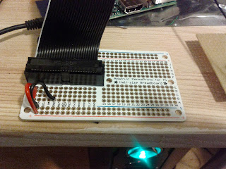
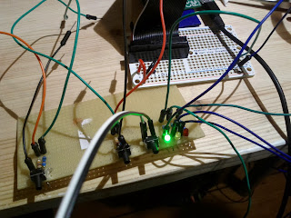

Bis auf den Verstärker sind alle Teile eingetroffen. Die Versandhändler meines Vertrauens haben schnell geliefert. Zeit für erste Bastelarbeiten und Tests des Systems...
Unter weiterlesen gibt es auch die ersten Bilder der Bastelarbeiten.

<!--more-->

### Raspbian oh Raspbian

Die SD-Karte für das Betriebssystem habe ich beim lokalen Dealer erstanden. Lief gerade eine Aktion in der Woche, so dass ich nun im Besitz einer 8GB Karte bin. Diese ist zwar ziemlich langsam aber für die Zwecke sehr gut geeignet. Die Einrichtung des Raspbian Image war etwas komplizierter, da anscheinend das Image sich nicht richtig aufspielen lies. Am Ende hat es mit dem NOOBS-Tool geklappt.

### Musik

Nach dem das Betriebssystem lief, habe ich den MPD (Musik Player Daemon) mit `apt-get install mpd mpc alsa-utils` installiert. Gleichzeitig noch den Kommandzeilen Client MPC installiert um den Daemon zu steuern. Die USB-Soundkarte wurde ebenfalls vom System sofort erkannt, so das eigentlich alles funktionieren sollte. Aber auch nur eigentlich, nach dem Anschließen der Kopfhörer erklang zwar Musik, aber die Stimmen der Moderatoren waren wie weit entfernt und total blechern. Es hat mich eine ganze Nacht gekostet, um zu bemerken, dass die Kopfhörer nicht richtig eingesteckt waren, argh...

### Breadboard

Im Anschluss daran standen dann die ersten Lötarbeiten an. Ich habe die Halterung für das GPIO Kabel an das Breadboard gelötet. Gleichzeitig auch schon Masse und Spannung mit den gekennzeichneten Bahnen verbunden. Das nachfolgende Bild zeigt dies. Im Vordergrund sind die Bahnen für 3,3 V und Masse zu sehen. Die beiden anderen Bahnen sind an 5 V und Masse angeschlossen.

### An und Aus

Im Internet gibt es eine gute [Anleitung](http://www.gtkdb.de/index_18_2237.html) für eine Shutdown- und Reset-Taster Schaltung. Ich hab zwar nur 300 Ohm Widerstände anstelle der angegebenen 330 Ohm verwendet aber das sollte kein Problem sein. Denn dieser Widerstand dient dazu den Raspberry Pi bzw. den GPIO vor zu hoher Stromstärke zu schützen. Durch den niedrigeren Widerstand kommt nun im Fehlerfall 1 mA mehr auf dem GPIO als mit 330 Ohm, also vernachlässigbar da die Grenze bei weitem unterschritten bleibt. Neben den beiden Tastern habe ich den Reset-Taster für die Senderwahl auf eine Lochrasterplatine gelötet. Alles ist als Pull-Up Schaltung realisiert.

### Es werde Licht

Als letztes habe ich noch 3 LEDs als Statusanzeigen auf die Lochrasterplatine gelötet. Die LEDs haben auch einen Vorwiderstand spendiert bekommen um die Spannung auf die richtige Höhe zu reduzieren. Zudem sind noch die Kabel für die Anschlüsse an das Breadboard an die Platine gelötet worden. Grüne Kabel für die Anschlüsse an die einzelnen GPIO Pins, schwarz bzw. dunkelblau für die Masse und rot für die 3,3 V Spannung. Nachfolgend ein Bild von dem fertigen Ergebnis. Hier teste ich gerade die grüne LED ob sie funktioniert.

Das erste Ergebnis ist schon mal nicht schlecht. Nun kommt die Bearbeitung des Holzes als Träger der Platinen und Raspberry Pi. Aber davon mehr im nächsten Beitrag.