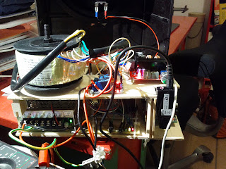

Lange habe ich nichts mehr geschrieben, nun ist es aber wieder so weit. Zu meiner Entschuldigung muss ich zugeben das ich das Projekt doch etwas vernachlässigt habe. Dennoch ist der jetzige Zwischenstand schon ganz ordentlich wie ich finde. Aber lest selber...

<!--more-->

### Probleme

Zwei Probleme sind aufgetreten. Zum einen lies sich das Relais nicht mit dem Raspberry Pi schalten. Das liegt daran, dass das Relaisboard LEDs hat um anzuzeigen ob die Relais geschaltet sind oder nicht. Die sind in Reihe geschaltet und nicht Parallel. Dummerweise liefert der Raspberry Pi nur 3,3V und somit zu wenig zum Betrieb der Relais da die LEDs zuviel ziehen. Um das Board mit den geforderten 5V zu betreiben und den Raspberry Pi nicht zu braten sind zwei Transistoren und ein paar Widerstände notwendig geworden.

### Verstärker

Das zweite Problem war doch glatt der Verstärker. Da habe ich nicht richtig gelesen what der für Spannungen voraussetzt. Es hätten +24 und -24 Volt sein müssen. Mein Netzteil liefert allerdings nur +24V. Da war dann erstmal guter Rat teuer. Nach ausführlichen googlen und lesen gab es eine mögliche Lösung. Es musste ein zweites baugleiches Netzteil her um die beiden mit einander zu verschalten. Dann hätte ich die geforderte Spannung gehabt.

### Ebay ist doch zu was zu gebrauchen

Die finale Lösung ergab sich dann doch über Ebay. Zufällig bin ich über eine Ringkerntrafo Auktion gestolpert. Der Trafo erfüllte meine Anforderungen und hat mehr Leistung als mein ursprünglich geplantes Netzteil. Zusammen mit einen neuen Verstärker (auch von Ebay), der mit Wechselspannung läuft, war dies günstiger als ein zweites Meanwell Netzteil. Jetzt hab ich allerdings einen Verstärker über.

### Hoch hinaus

Nach dem der Trafo und Verstärker geliefert wurden, stellte sich die Frage wie soll das eingebaut werden. Die Breite und Tiefe ist begrenzt und mit dem Netzteil, Permaboard, Schrittmotor und Raspberry Pi voll ausgenutzt. Da blieb nur noch nach Oben. Ich habe dann aus Holz eine zweite Ebene konstruiert und diese auf die untere aufgesetzt. Das folgende Bild zeigt das Ergebnis.

Das Bild habe ich aufgenommen, als ich den Lautstärke Poti verlötet habe. Das Innenleben leuchtet im Betrieb wie ein Weihnachtsbaum.

### Musik... man hört ja was

Während ich diesen Beitrag hier verfasse, läuft neben mir das Radio im Probebetrieb. Ich muss sagen, ich hatte wegen dem Gehäuse und Verstärker mit einer schlechteren Qualität gerechnet, aber dem ist nicht so. Mal schauen wie es sich anhört wenn alles fertig ist. Die nächsten Schritte sind, den Lautstärke Poti verbauen, Pseudo Ein-/Ausschalter verdrahten, Drehimpulsgeber verdrahten und Drehscheibe konstruieren. Es nähert sich also dem Ende entgegen. Demnächst gibt es wieder mehr zu berichten.
