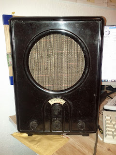
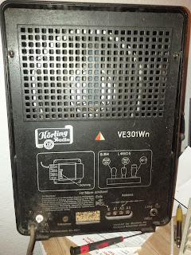

Mein erstes "richtiges" Raspberry Pi Projekt steht also fest. Ich will den alten Volksempfänger umbauen zu einen modernen Internetradio. Doch bevor es an die Umsetzung geht, sollte man sich Gedanken machen was man eigentlich genau bauen möchte und ob das auch wirklich so funktioniert. Einfach loslegen funktioniert nicht, gesunde Planung ist angesagt. In disem Blogbeitrag beschreibe ich wie ich mir die neuen Funktionen der Bedienelemente vorstelle.

<!--more-->

### Drehknöpfe mal 3

Ok, also wenn man sich die Vorderseite des Radios anschaut, siehe Bild, ist es doch sehr schlicht gehalten. Auffällig sind das es drei Drehknöpfe gibt mit unterschiedlichen Funktionen.

Diese Drehknöpfe will ich weiterhin erhalten und in einen Fall einer anderen Funktion zuführen als im Original. Der mittlere Drehknopf war für die Frequenzwahl, ok das sollte natürlich so bleiben. Rechts daneben der Knopf hat einmal die Lautstärke geregelt und das sollte sich auch nicht ändern. Der Linke hat mir etwas Kopfzerbrechen bereitet da dies die Antennenkopplung war und ich das in der Funktion nicht benötige.

### Ein- und Aus

Als neue Funktion für den linken Drehknopf habe ich mir daher überlegt, dass dies der Ein- bzw. Ausschalter sein soll. Ursprünglich befindet sich der sich auf der Rückseite des Gerätes. Was aus heutiger Benutzersicht etwas unglücklich ist. Da man heutzutage die Computer nicht mehr einfach so ausschalten sollte, denn dies wirkt sich sehr negativ auf das Betriebssystem aus, ist es nur ein "Pseude" Ein- bzw. Ausschalter der die Wiedergabe startet oder stoppt. Zum anderen braucht der Raspberry Pi ziemlich lange zum starten, daher ist es auch eine Geschwindigkeitsfrage.

### LCD, Ja oder Nein

Oberhalb des mittleren Drehknopfes befindet sich eine Drehscheibe auf der die Sender und deren Frequenzen notiert sind. Hier stellt sich die Frage ob man das so lassen will oder lieber durch ein modernes LCD Display ersetzen will. Ich persönlich finde die altmodische Drehscheibe cooler, deshalb wird dies auch so bleiben. Wird sicherlich spannend sein, dass ganze so zu basteln das die Drehschreibe passend zum Drehknopf mit dreht und der richtige Sender gespielt wird.

### Die Rückseite

Nun komme ich zur Rückseite des Geräts. Wie man auf dem folgenden Bild sehen kann, birgt die Rückseite Möglichkeiten für Anschlüsse.

Auffällig ist hier der weiße Ein- und Ausschalter. Da ich diesen nach vorne verlege bleibt dort ein Loch in dem ich die Zugentlastung für das neue Netzkabel einbauen werde. Daneben befindet sich ein "Entbrummer"-Poti sowie ein Typenschild und die Eingänge für die Antennenkabel. Ganz rechts ist noch ein Schalter für Mittel- oder Langwelle.

### Löcher über Löcher

Da ich die alte Technik entfernen werde, habe ich durch die frei gewordenen Löcher von Entbrummer, Typenschild und Antenneneingänge jede Menge Platz für Taster und Status-LEDs. Wo ich welchen Taster einbauen werde, weiß ich noch nicht genau. Eine mögliche Belegung könnte aber so sein:

*   Entbrummerloch wird zum Reset der Programmliste
*   Typenschildloch bietet Platz für Status-LEDs
*   Antenneneingängeloch kann mit Reset- und Shutdowntaster ausgestattet werden

Technisch gesehen werde ich einen Drehimpulsgeber für die Senderwahl benutzen, der kann aber nur sagen ob der Drehknopf nach Links oder Rechts gedreht wurde und nicht wo er steht. Daher benötige ich eine Resettaste für die Programmliste für den Fall, dass der angezeigte Name auf der Drehscheibe nicht mehr mit dem gespielten Programm über einstimmt. Dies passiert wenn der Raspberry Pi aus irgend einen Grund neu gestartet und der Drehknopf für die Sendliste nicht vor dem Neustart wieder auf den ersten Sender gesetzt wird.

### Shutdown -h now

Um den Raspberry Pi wirklich herunter zu fahren, wird es auf der Rückseite einen Taster zum Ausschalten geben. Ebenso einen Taster für einen harten Reset. [Hier](http://www.gtkdb.de/index_18_2237.html) findet man eine gute Anleitung wie beide Taster geschaltet werden müssen, damit sie ihren Einsatzzweck erfüllen. Welche Status-LEDs ich benutzen werde, habe ich mir noch gar nicht so genau überlegt. Das wird sich bei der Umsetzung zeigen.

Als nächstes geht es daran zu definieren, welche Bauteile werden benötigt, aber davon werde ich im nächsten Beitrag berichten.
