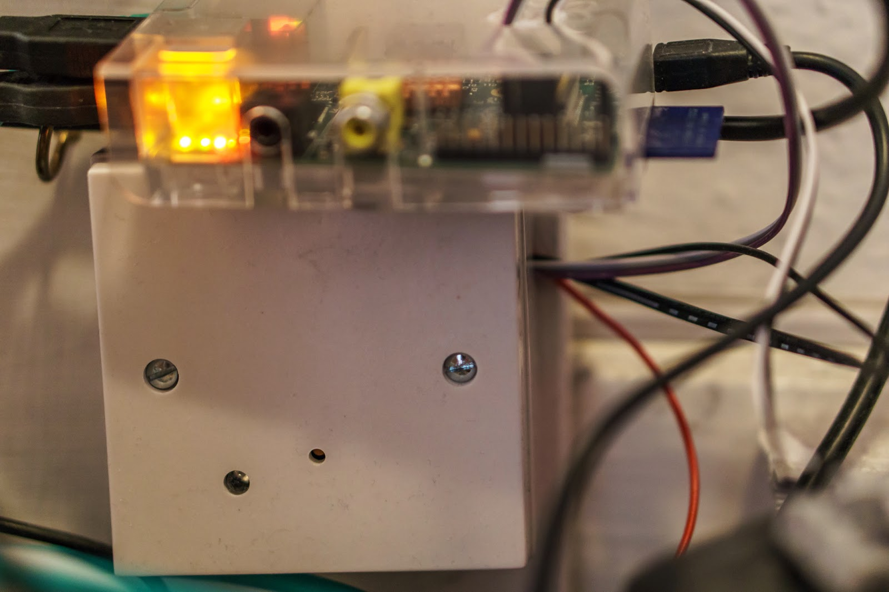
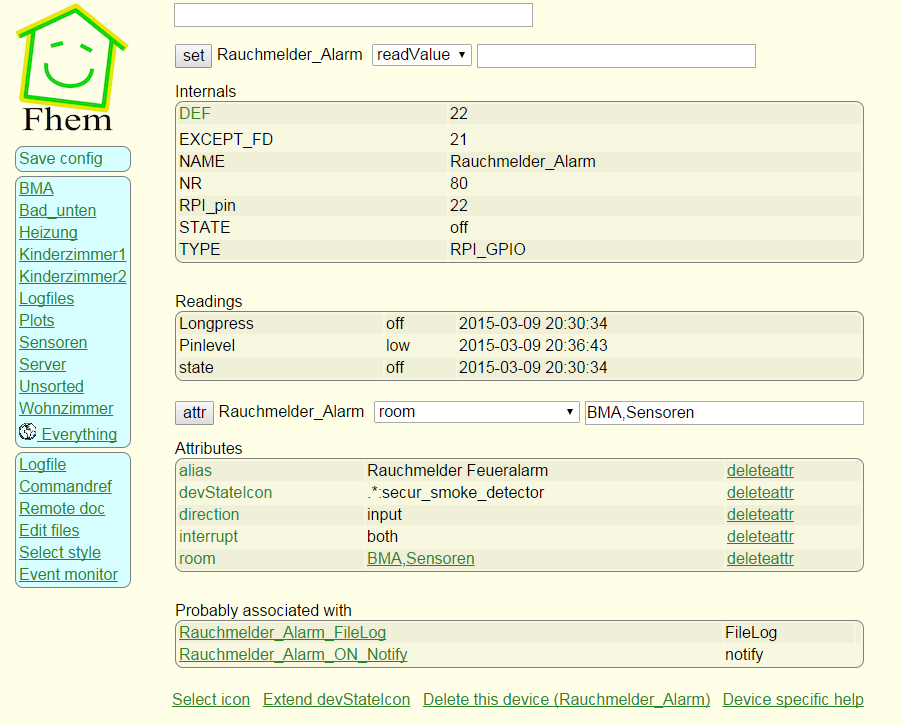
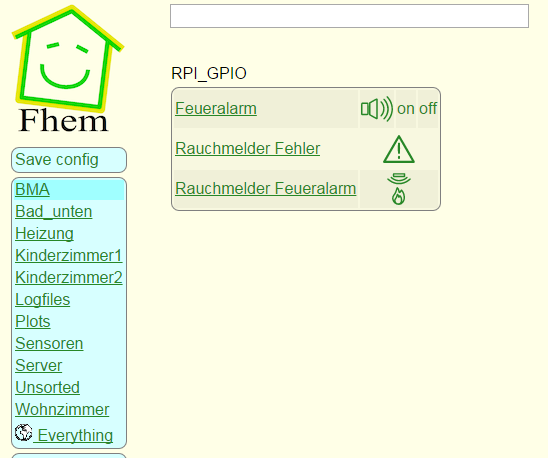
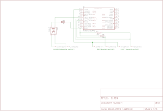

Hier nun der zweite und letzte Teil des Rauchmelderprojekts. Die Schaltung und das Modul Ei413 arbeiteten ja schon zusammen, jetzt fehlte nur noch die Anbindung an den Pi und FHEM. Ferner mussten natürlich noch die Rauchmelder codiert und montiert werden. Dies alles habe ich in den letzten Tagen erledigt. Leider konnte ich das nicht Abends machen, da so ein Rauchmelder ordentlich Krach macht und wenn die Kinder schlafen, kommt das nicht so gut. 
 
 
<h3>
Kabel stecken eins, zwei, drei</h3>

 

Die Verkabelung an dem Pi war ziemlich zügig erledigt, ebenso die Montage des Ei413. Einzig etwas bockig war das Gehäuse des Pi, das musste ich erst noch bearbeiten damit ich Löcher hatte für die Kabel. Hätte ich mir damals besser eins kaufen sollen wo extra Lücken sind für die Kabel an dem GPIO. Aber so geht es auch und es funktioniert genau so gut. Auf dem Bild sieht man den Pi wie er auf dem Ei413 Modul liegt.&nbsp;

 

 

 

<h3>
Piiiiep... Piiiiep....</h3>

 

Um zu testen ob das Ganze auch mit dem Pi funktioniert habe ich mir als erstes ein kleines Python Script geschrieben welches für ein paar Sekunden den GPIO Port 17 schaltet. Der Port 17 ist mit dem Eingang des Ei413 potentialfrei verbunden. Nach anlegen des High Pegel durch das Script, dauert es ein paar Sekunden bis alle Melder sich lautstark bemerkbar machten. Der Test in die andere Richtung erfolgte durch drücken des Tasters an einen der Melder. Wie gewünscht verzeichnete der GPIO Port 22 ein High Pegel. Einzig der Eingang für das Fehlersignal lässt sich nicht testen, da ich keinen Fehler in einen der Melder produzieren kann.

 

<h3>
FHEM... Einbindung leicht gemacht!</h3>

 

Da meine Hausautomatisierung die Software FHEM benutzt, konnte ich mein Python Script so nicht nutzen. Ist aber auch nicht notwendig gewesen, da FHEM modular aufgebaut ist und es ein GPIO Modul gibt. So brauchte ich nur ein paar Definitionen eingeben und quasi schon funktionierte das Ganze. Ich war ganz überrascht das es so leicht war. Nachfolgend die Definition in FHEM für die Erkennung eines Feueralarms.

 

<blockquote class="tr_bq">
<blockquote class="tr_bq">
define Rauchmelder_Alarm RPI_GPIO 22</blockquote>
<blockquote class="tr_bq">
attr Rauchmelder_Alarm alias Rauchmelder Feueralarm</blockquote>
<blockquote class="tr_bq">
attr Rauchmelder_Alarm devStateIcon .*:secur_smoke_detector</blockquote>
<blockquote class="tr_bq">
attr Rauchmelder_Alarm direction input</blockquote>
<blockquote class="tr_bq">
attr Rauchmelder_Alarm interrupt both</blockquote>
<blockquote class="tr_bq">
attr Rauchmelder_Alarm room BMA,Sensoren</blockquote>
<blockquote class="tr_bq">
define Rauchmelder_Alarm_FileLog FileLog ./log/Rauchmelder_Alarm-%Y.log Rauchmelder_Alarm</blockquote>
<blockquote class="tr_bq">
attr Rauchmelder_Alarm_FileLog logtype text</blockquote>
<blockquote class="tr_bq">
attr Rauchmelder_Alarm_FileLog room Logfiles</blockquote>
<blockquote class="tr_bq">
define Rauchmelder_Alarm_ON_Notify notify Rauchmelder_Alarm:on* {my $tme=TimeNow();; fhem ("set Pushover_sbn msg 'Feueralarm ausgelöst' 'Feueralarm um $time ausgelöst' '' 0 ''")}</blockquote>
</blockquote>
&nbsp;Die Definition für das auslösen eines Feueralarms sieht dann so aus: 
<blockquote class="tr_bq">
<blockquote class="tr_bq">
define Feueralarm RPI_GPIO 17</blockquote>
<blockquote class="tr_bq">
attr Feueralarm devStateIcon .*:audio_volume_high</blockquote>
<blockquote class="tr_bq">
attr Feueralarm direction output</blockquote>
<blockquote class="tr_bq">
attr Feueralarm room BMA</blockquote>
<blockquote class="tr_bq">
define Feueralarm_FileLog FileLog ./log/Feueralarm-%Y.log Feueralarm</blockquote>
<blockquote class="tr_bq">
attr Feueralarm_FileLog logtype text</blockquote>
<blockquote class="tr_bq">
attr Feueralarm_FileLog room Logfiles</blockquote>
</blockquote>
Die Oberfläche von FHEM ist zwar nicht so hübsch und bunt, dafür aber sehr Tekki lastig. Der nachfolgende Screenshot zeigt die Einrichtung des Alarm Eingangssignals in der Oberfläche von FHEM. 

 

 
&nbsp;Insgesamt habe ich die einzelnen Ein- und Ausgänge in dem virtuellen FHEM Raum "BMA" zusammen gebündelt. Das sieht dann so aus: 

 

 

<h3>
Push it baby...</h3>

 

Ein weiteres tolles Feature von FHEM ist das Modul Pushover. Es ermöglicht mit dem Dienst Pushover Push Notifications ans Handy (iOS oder Android) zu senden. Ich habe das jetzt eingerichtet um zu signalisieren wenn die Melder einen Alarm oder Fehler melden. Man hat zwar pro Anwendung die man registriert nur 7500 Notifications pro Monat frei, aber ich denke das wird locker ausreichen. Mal sehen was ich noch für Push Notifications in FHEM einbauen kann.

 

 

<h3>
Ende gut alles gut</h3>

Die Vernetzung zwischen Rauchmeldern und Hausautomatisierung ist erfolgreich abgeschlossen. Sogar eine Benachrichtung aufs Handy ist realisiert. FHEM hat es einen doch sehr einfach gemacht die Sachen einzurichten und zu nutzen. Mir hat es sehr viel Spaß gemacht das Projekt zu realisieren und ich denke ich werde weitere Projekte im Bereich Hausautomatisierung folgen lassen. Als nächstes werde ich über FHEM bloggen und dem was ich bis dato schon alles umgesetzt habe an Hausautomatisierung. 
 
<h3>
Update 08.11.2015</h3>

Hier noch der Schaltplan:

 

