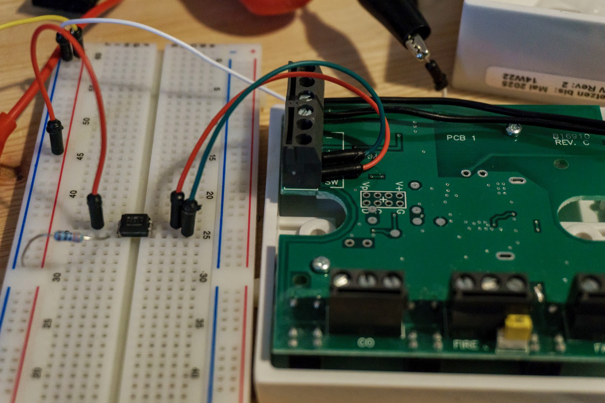
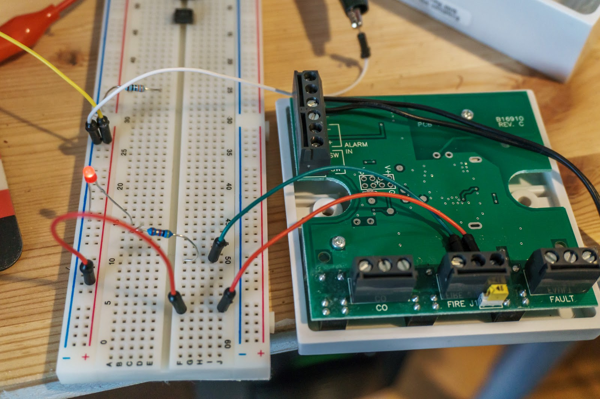
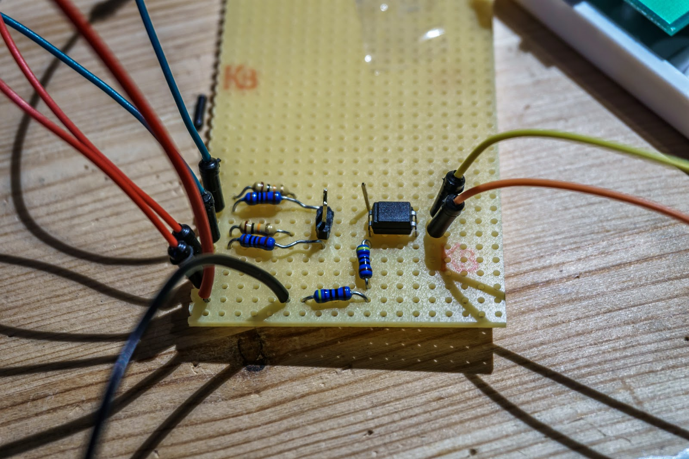

Der letzte Eintrag ist zwar schon eine Weile her, nichts desto trotz hat sich viel getan. Mittlerweile werkeln 4 Pi bei mir und die Hausautomatisierung schreitet voran. Aktuell ist gerade das Projekt Rauchmelder angesagt, da seit dem 01.01.2015 Rauchmelder in BaWü Pflicht sind. Meine Idee ist es die Rauchmelder an einen der Pi anzuschließen um Events wie Feueralarm oder Fehler mit zu bekommen. 
 
<h3>
Vorüberlegungen</h3>

 

Da bereits im Hausflur auf verschiedenen Ebenen funkvernetzte Rauchmelder installiert sind und wir damit sehr gute Erfahrungen gemacht haben. Gab es eigentlich keine Frage ob dieses System auch weiterhin betrieben und erweitert wird. Mittlerweile gibt es von der Firma Ei Electronics neuere Modelle des Rauchmelders, es wird aber von Seiten der Firma versichert, dass die alten Geräte mit den neuen zusammen arbeiten können. Mal sehen ob dies auch stimmt. Ursprünglich war angedacht im ganzen Haus jede Wohnung mit den Meldern auszurüsten, aber ein Miteigentümer wollte lieber eigene "kleine" Rauchmelder haben die optisch nicht so störend wirken. So besorgt sich nun jeder Miteigentümer seine Melder selber.

 

<h3>
Materialliste</h3>
 
Wie schon geschrieben gibt es neue Rauchmelderprodukte von der Firma Ei Electronics. Interessanterweise ist dort das Funkmodul nicht mehr integriert wie in den alten Rauchmeldern des Typs 405. Somit viel die Wahl auf den Ei650W Rauchmelder und dem Ei650M Funkmodul. Da wir die Wohnung über den gesetzlichen Anforderungen hinaus sichern wollen, musste noch ein Hitzemelder her. Denn Rauchmelder neigen in Küchen gerne mal zu Fehlalarmen. Da ist die Wahl auf den Ei603TYC gefallen. 
 
 
<ul>
<li>5 x Ei50W</li>
<li>1 x Ei603TYC</li>
<li>6 x Ei650M</li>
<li>1 x Ei413</li>
</ul>

 

<h3>
Anschluß an die Brandmeldeanlage</h3>

 

Alle Rauch-/Hitzemelder und Funkmodule sind 10 Jahres Batterien ausgestattet und da nach Din Norm eh alle 10 Jahre die Melder getauscht werden sollen, perfekt für uns. Erspart das lästige jährliche Wechseln der 9V Batterien. Das Modul Ei413 ist eigentlich für den Anschluss an eine Sicherheits- oder Brandmeldeanlage gedacht. Es bietet 3 Ausgänge und 1 Eingang. Ich nutze dies um die Signale für Feueralarm und Fehler in meinen Pi per FHEM zu visualisieren bzw. dann weitere Meldungen zu verschicken. Der dritte Ausgang für CO2 Warner ist bei uns nicht in Betrieb da wir keinen benötigen. Über den Eingang am Ei413 kann ich per Pi einen Feueralarm auslösen.

 

 

<h3>
Lötkolben in Action</h3>

 

Um den Eingang am Ei413 zu schalten bietet dieser die Möglichkeit das Ganze potentialfrei oder per 12 V Spannung zu tun. Da ich aus dem Pi nur schlecht 12 V Spannung bekomme habe ich mich für das potential freie schalten entschieden. Dies hab ich über einen Optokobler (PC817) realisiert. Nachfolgend ein Foto der Schaltung auf dem Breadboard.

 

 

Für die Ausgänge bietet das Modul eine potentialfreie Schaltung per Relais an. Dementsprechend habe ich nur eine Pull-Down Schaltung pro Ausgang realisieren müssen. Auch hiervon ein Foto vom Breadboard mit einer LED als Test das der Ausgang geschaltet wurde.

 

 

 

Anschließend das Ganze noch auf eine Lochrasterplatine gebracht und verlötet.&nbsp;

 

 

<h3>
Hardware Teil - check... Software - needs to be done</h3>

Die Hardware funktioniert soweit, ist aber noch nicht final an der Wand montiert und am Pi angeschlossen. Hier warte ich noch auf ein USB Verlängerungskabel um den CUL (Sender/Empfänger des FS20 Hausautomatisierungssystems) an einer anderen Stelle platzieren zu können als den Pi. Wenn dies erledigt ist erfolgt die Software und Anbindung an FHEM.

 

 

